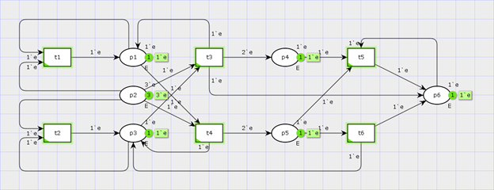
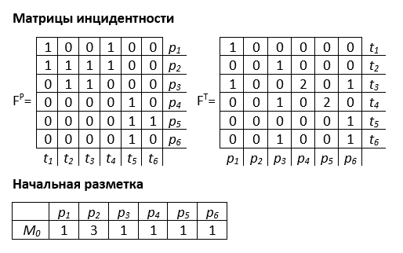
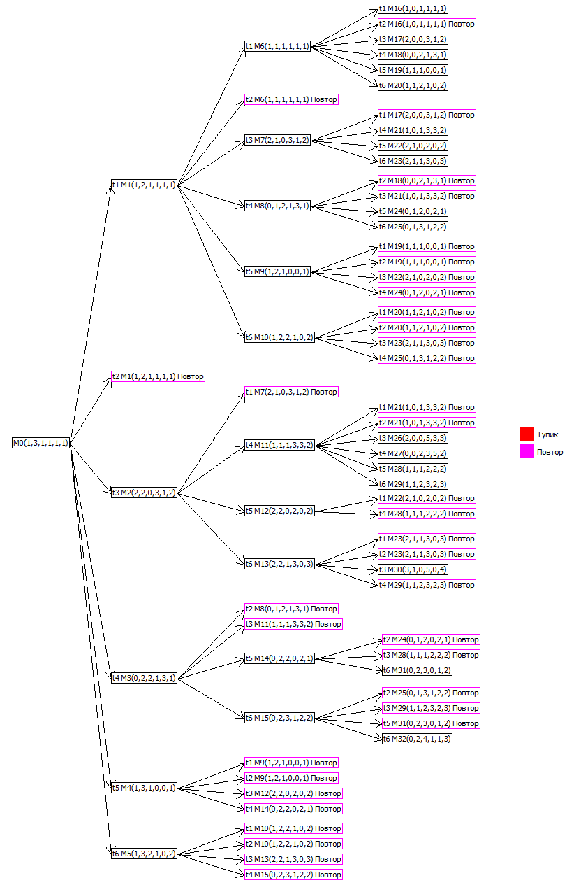
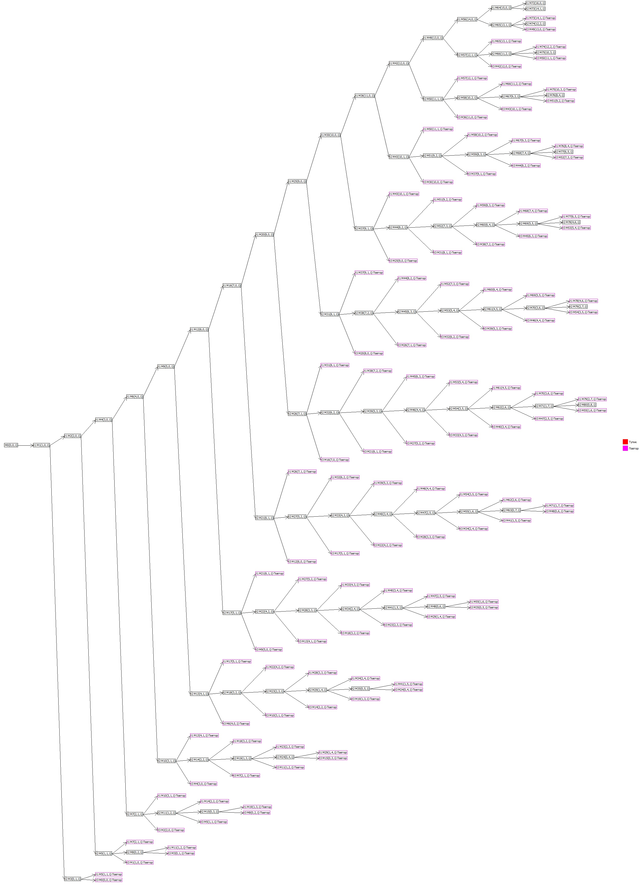
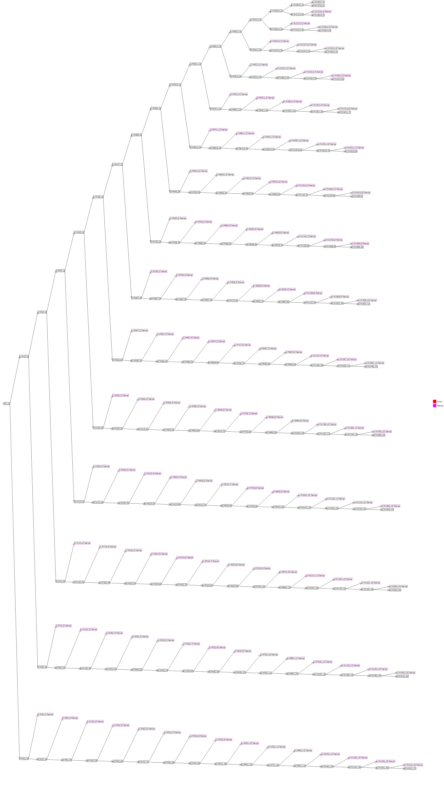

# PNtree
Обход обыкновенной сети Петри, генерация дерева маркировок и словаря сети

Программа написана и собрана в Borland C++ Builder

## Примеры работы
    
Исходная сеть в программе CPN-Tools

#### Исходные данные
    

#### Результат работы программы
    

#### Забавные результаты работы программы
    
    
